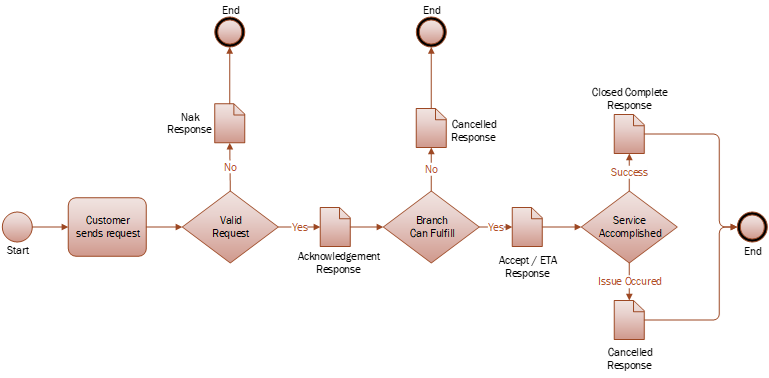

##### Table of Contents  
1. [Overview](#overview)  
2. [Transport](#transport)  
3. [File Naming](#file-naming)
4. [XML Message Payload](#xml-message-payload)  
  4.1. [Create an Incident](#create-an-incident)<br/>
  4.2. [Non Acknowledgement (NAK)](#non-acknowledgement-nak)<br/>
  4.3. [Acknowledgement (ACK)](#acknowledgement-ack)<br/>
  4.4. [Accept](#accept)<br/>
  4.5. [Close Complete](#close-complete)<br/>
  4.6. [Cancel](#cancel)

## Overview
Loomis supports the creation of Incidents for ATM service through the exchange of files using SFTP.  



Customers will upload request files to Loomis and can expect update messages for **ACK**, **NAK**, **Accept**, **Close** and **Cancel**.

---
## Transport
The file based solution is comprised of exchanging XML documents via SFTP.  The SFTP server is hosted by Loomis.
> SFTP server, username and password provided during onboarding
#### Inbound
The customer will connect to the Loomis FTP Server to upload an incident dispatch message to the **Inbound** folder. 
> Inbound folder: **/to_loomis**

#### Outbound
Loomis will place updates for NAK, ACK, Accept, Close Complete or Canceled in the **Outbound** folder.  The customer is responsible for retrieving the update messages. 
> Outbound folder: **/from_loomis**


---
## File Naming
Loomis won't validate or extract data from the incoming Dispatch requests file names.<br/>
Below is out recommendation for the incoming Dispatch requests file names.<br/>
Loomis uses the following file naming convention for the outgoing files.

#### Naming
\<Bank Name>\_\<File DateTime in UTC>\_\<ATM Id>\_\<Message Type>.xml

#### Message Types
| Message Type | Details                                                |
|--------------|--------------------------------------------------------|
| dispatch     | Incident request provided by the customer              |
| nak          | Not Acknowledged - there was an issue with the request |
| ack          | Acknowledged                                           |
| accept       | Accepted and Estimated Time of Arrival info            |
| close        | Service completed successfully                         |
| cancel       | Service canceled                                       |

#### Examples
##### Inbound Service Dispatch Request Message
```
ExampleBank_20191024102530_A123456_dispatch.xml
```
##### Outbound Acknowledgement Message:
```
ExampleBank_20191024102530_A123456_ack.xml
``` 
##### Outbound Accept/ETA Message:
```
ExampleBank_20191024102530_A123456_accept.xml
``` 
##### Outbound Closed Message:
```
ExampleBank_20191024102530_A123456_close.xml
``` 


---
## XML Message Payload

### Create an Incident
The Dispatch message is sent by a customer to request an ATM service. The request is evaluated for validity and appropriately processed.

#### Message Format
```xml
<Incident>
    <MessageType>Dispatch</MessageType>
    <CustomerId>1234567</CustomerId> 
    <ServiceProvider>LOOMIS</ServiceProvider>  
    <IncidentReference>178788692</IncidentReference>
    <DeviceId>A123456</deviceId>
    <DeviceStatus>Active</DeviceStatus>
    <FaultCode>EmergencyDepositPull</FaultCode>
    <FaultDateTime>2018-11-16T15:17:48Z</FaultDateTime>
    <Notes>Additional information</Notes>
    <Amounts>
      <Amount currency="USD" denomination="1">877</Amount>
      <Amount currency="USD" denomination="5">1055</Amount>
      <Amount currency="USD" denomination="20">1010</Amount>
      <Amount currency="USD" denomination="20">1020</Amount>
      <Amount currency="USD" denomination="50">1050</Amount>
      <Amount currency="USD" denomination="100">1100</Amount>
    </Amounts>
<Incident>
```

#### Data Definitions 

| XML Node           | Required | Details                                                                            |
|--------------------|----------|------------------------------------------------------------------------------------|
| MessageType        | Yes      | Describes the intended action for the message. Set to "Dispatch".                  |
| CustomerId         | Yes      | Specified customer ID. Provided by Loomis.                                         |
| ServiceProvider    | Yes      | This value is stored and returned in update messages.                              |
| IncidentReference  | Yes      | Customer incident number. This value is stored and returned in update messages.    |
| DeviceId           | Yes      | ATM ID                                                                             |
| DeviceStatus       | No       | "Active" or "Inactive"                                                             |
| FaultCode          | Yes      | Fault Code, or ID, from table below.                                               |
| FaultDateTime      | Yes      | Date and Time when problem started, in UTC. Example: 2018-11-16T15:17:48Z          |
| Notes              | No       | Information text.                                                                  |
| Amount[USD 1]      | No       | Default is 0. Total amount of 1s. Must be divisible by 1.                          |
| Amount[USD 5]      | No       | Default is 0. Total amount of 5s. Must be divisible by 5.                          |
| Amount[USD 10]     | No       | Default is 0. Total amount of 10s. Must be divisible by 10.                        |
| Amount[USD 20]     | No       | Default is 0. Total amount of 20s. Must be divisible by 20.                        |
| Amount[USD 50]     | No       | Default is 0. Total amount of 50s. Must be divisible by 50.                        |
| Amount[USD 100]    | No       | Default is 0. Total amount of 100s. Must be divisible by 100.                      |

#### Fault Codes and IDs 
> Fault Codes will be provided during onbording

---
## Non Acknowledgement (NAK)
NAK messages are returned to a customer in the event of issues processing the Incident Dispatch request. A NAK response will occur for the following reasons:

| Response Code     | Description                                                         |
|-------------------|---------------------------------------------------------------------|
| Duplicate         | Existing incident found based for DeviceId and FaultCode, or IncidentReference, within a 24 hour time period. |
| InvalidFault      | Invalid FaultCode for this customer.                                |
| DeviceNotFound    | DeviceId is not found for this customer.                            |
| MissingAmounts    | No Amounts specified when required, Fault is Cash Add/Swap.         |

#### Message Format
```xml
<Incident>
  <MessageType>NAK</MessageType>
  <CustomerId>1234567</CustomerId> 
  <ServiceProvider>LOOMIS</ServiceProvider> 
  <IncidentReference>1100002</IncidentReference>
  <ResponseCode>Duplicate</ResponseCode>
  <ResponseText>Additional information</ResponseText> 
</Incident>
```
#### Data Definitions 
| XML Node           | Required | Details                                                     |
|--------------------|----------|-------------------------------------------------------------|
| MessageType        | Yes      | Set to "NAK". Describes the intended action for the message. | 
| CustomerId         | Yes      | Specified customer id, provided by Loomis.                  |
| ServiceProvider    | Yes      | Value provided for this field is returned.                  |
| IncidentReference  | Yes      | Customer incident number provided in initial request.       |
| ResponseCode       | Yes      | Reason for the NAK, see table Response Codes table.         |
| ResponseText       | Yes      | Additional information about this incident response.        |

---
## Acknowledgement (ACK)
A valid message request message will be processed and return an acknowledgement to the requesting entity.  

#### Message Format

```xml
<Incident>
  <MessageType>ACK</MessageType>
  <CustomerId>1234567</CustomerId> 
  <ServiceProvider>LOOMIS</ServiceProvider> 
  <IncidentId>INC0004086</IncidentId>
  <IncidentReference>1100002</IncidentReference>
  <ResponseText>Additional information</ResponseText> 
</Incident>
```

#### Data Definitions 
| XML Node           | Required | Details                                                     |
|--------------------|----------|-------------------------------------------------------------|
| MessageType        | Yes      | Set to "ACK". Describes the intended action for the message. | 
| CustomerId         | Yes      | Specified customer id, provided by Loomis.                  |
| ServiceProvider    | Yes      | Value provided for this field is returned.                  |
| IncidentId         | Yes      | Loomis incident number created.                             |
| IncidentReference  | Yes      | Customer incident number provided in initial request.       |
| ResponseText       | Yes      | Additional information about this incident response.        |

---
## Accept
The Accept message is sent when a Loomis Branch determines they can fulfill the request.  The main data to be sent to the customer is the ETA date and time.  

#### Message Format
```xml
<Incident>
  <MessageType>Accept</MessageType>
  <Customer>1234567</Customer> 
  <ServiceProvider>SP1</ServiceProvider> 
  <IncidentId>INC0004086</IncidentId>
  <IncidentReference>1100002</IncidentReference> 
  <EtaDateTime>2014-09-23T17:45:22Z</EtaDateTime> 
  <ResponseText>Additional information</ResponseText>
</Incident>  

```
#### Data Definitions

| XML Node           | Required | Details                                                                          |
|--------------------|----------|----------------------------------------------------------------------------------|
| MessageType        | Yes      | Set to "Accept". Describes the intended action for the message.                  | 
| CustomerId         | Yes      | Specified customer number, provided by Loomis                                    |
| ServiceProvider    | Yes      | Value provided for this field is returned                                        |
| IncidentId         | Yes      | Loomis Dispatch Incident ID                                                      |
| IncidentReference  | Yes      | Unique customer incident number provided in initial request                      |
| EtaDateTime        | Yes      | Estimated time when request can be completed, UTC. Example: 2014-09-23T09:45:22Z |
| ResponseText       | No       | Optional - Notes about this response                                             |


## Close Complete
On successful completion of ATM service, a message will be generated with closure information.

#### Message Format
```xml
<Incident> 
  <MessageType>Close</MessageType>
  <CustomerId>1234567</CustomerId> 
  <ServiceProvider>SP1</ServiceProvider> 
  <ResponseText>Close details</ResponseText> 
  <IncidentId>INC0004086</IncidentId>
  <IncidentReference>1100002</IncidentReference> 
  <CloseDateTime>2014-09-23T16:45:49Z</CloseDateTime> 
</Incident> 
```

#### Data Definitions

| XML Node           | Required | Details                                                             |
|--------------------|----------|---------------------------------------------------------------------|
| MessageType        | Yes      | Set to "Close". Describes the intended action for the message.      | 
| CustomerId         | Yes      | Specified customer number, provided by Loomis                       |
| ServiceProvider    | Yes      | Value provided for this field is returned                           |
| ResponseText       | Yes      | Closure information to include up to 3 fix codes and comments       |
| IncidentId         | Yes      | Loomis Dispatch Incident ID                                         |
| IncidentReference  | Yes      | Unique customer incident number provided in initial request         |
| CloseDateTime      | Yes      | Date and time service completed, in UTC. Example: 2014-09-23T09:45:22Z |

## Cancel
In the event ATM service cannot be completed, a canceled message will be generated.  This can occur for inclement weather or a variety of reasons.  

#### Message Format
```xml
<Incident> 
  <MessageType>Cancel</MessageType>
  <CustomerId>1234567</CustomerId> 
  <ServiceProvider>LOOMIS</ServiceProvider> 
  <ResponseText>Cancel details</ResponseText>
  <IncidentId>INC0004086</IncidentId>
  <IncidentReference>1100002</IncidentReference> 
  <CancelDateTime>2014-09-23T16:45:49Z</CancelDateTime> 
<Incident>
```
#### Data Definitions

| XML Node           | Required | Details                                                            |
|--------------------|----------|--------------------------------------------------------------------|
| MessageType        | Yes      | Set to "Cancel". Describes the intended action for the message.    | 
| CustomerId         | Yes      | Specified customer number, provided by Loomis.                     |
| ServiceProvider    | Yes      | Always set to: LOOMIS                                              |
| ResponseText       | Yes      | Closure information including cancel reason and comments           |
| IncidentId         | Yes      | Loomis Dispatch Incident ID                                        |
| IncidentReference  | Yes      | Unique customer incident number provided in initial request        |
| CancelDateTime     | Yes      | Date and time service was canceled, in UTC. Example: 2014-09-23T09:45:22Z |

