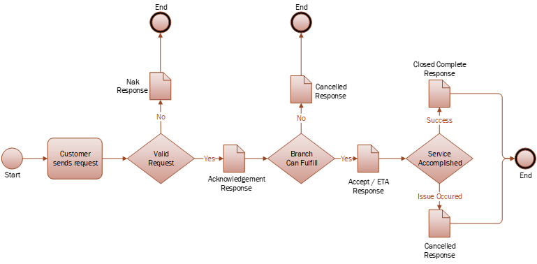

# Loomis Customer Service ATM Customer Incidents REST/JSON integration

##### Table of Contents  
1. [Overview](#overview)  
2. [Transport](#transport)  
3. [JSON Message Payload](#json-message-payload)  
  3.1. [Create an Incident](#create-an-incident)<br/>
  3.2. [Non Acknowledgement (NAK)](#non-acknowledgement-nak)<br/>
  3.3. [Acknowledgement (ACK)](#acknowledgement-ack)<br/>
  3.4. [Accept](#accept)<br/>
  3.5. [Close Complete](#close-complete)<br/>
  3.6. [Cancel](#cancel)<br/>

## Overview
Loomis supports the creation of Incidents for ATM service through REST based web services.  



Customers will send **Dispatch** requests and can expect update messages for **ACK**, **NAK**, **Accept**, **Close** and **Cancel**.

---
## Transport
The web service solution is comprised of exchanging JSON messages via REST based web services.  

> Endpoints and credentials will be provided during onboarding

## JSON Message Payload

#### Message Types
| Message Type | Details                                                |
|--------------|--------------------------------------------------------|
| dispatch     | Incident request provided by the customer              |
| nak          | Not Acknowledged - there was an issue with the request |
| ack          | Acknowledged                                           |
| accept       | Accepted and Estimated Time of Arrival info            |
| close        | Service completed successfully                         |
| cancel       | Service canceled                                       |


### Create an Incident
The Dispatch message is sent by a customer to request an ATM service. The request is evaluated for validity and appropriately processed.

#### Message Format
```json
{
   "MessageType":"Dispatch",
   "CustomerNumber":"1234567", 
   "IncidentReference":"178788692",
   "ATMNumber":"CU560572",
   "DeviceStatus":"Active",
   "FaultCode":"EmergencyDepositPull",
   "FaultDateTime":"2018-11-16T15:17:48Z",
   "Notes":"Additional information",
   "AmountUSD1":"877",
   "AmountUSD5":"1055",
   "AmountUSD10":"1010",
   "AmountUSD20":"1020",
   "AmountUSD50":"1050",
   "AmountUSD100":"1100"
}
```

#### Data Definitions 

| JSON Node              | Required | Details                                                                            |
|------------------------|----------|------------------------------------------------------------------------------------|
| MessageType            | Yes      | Describes the intended action for the message. Set to "Dispatch".                  |
| CustomerNumber         | Yes      | Specified customer number. Provided by Loomis.                                         |
| IncidentReference      | Yes      | Customer incident number. This value is stored and returned in update messages.    |
| ATMNumber              | Yes      | ATM ID                                                                             |
| DeviceStatus           | No       | "Active" or "Inactive"                                                             |
| FaultCode              | Yes      | Fault Code, or ID, from table below.                                               |
| FaultDateTime          | Yes      | Date and Time when problem started, in UTC. Example: 2018-11-16T15:17:48Z          |
| Notes                  | No       | Information text.                                                                  |
| Amount[USD 1]          | No       | Default is 0. Total amount of 1s. Must be divisible by 1.                          |
| Amount[USD 5]          | No       | Default is 0. Total amount of 5s. Must be divisible by 5.                          |
| Amount[USD 10]         | No       | Default is 0. Total amount of 10s. Must be divisible by 10.                        |
| Amount[USD 20]         | No       | Default is 0. Total amount of 20s. Must be divisible by 20.                        |
| Amount[USD 50]         | No       | Default is 0. Total amount of 50s. Must be divisible by 50.                        |
| Amount[USD 100]        | No       | Default is 0. Total amount of 100s. Must be divisible by 100.                      |

#### Fault Codes and IDs 
> Fault Codes will be provided during onbording

---
### Non Acknowledgement (NAK)
NAK messages are returned to a customer in the event of issues processing the Incident Dispatch request. A NAK response will occur for the following reasons:


| Response Code     | Description                                                         |
|-------------------|---------------------------------------------------------------------|
| Duplicate         | Existing incident found based for ATMNumber and FaultCode, or IncidentReference, within a 24 hour time period. |
| InvalidFault      | Invalid FaultCode for this customer.                                |
| DeviceNotFound    | ATMNumber is not found for this customer.                            |
| MissingAmounts    | No Amounts specified when required, Fault is Cash Add/Swap.         |


#### Message Format
```json
{
  "MessageType":"NAK",
  "CustomerNumber":"1234567",
  "ServiceProvider":"LOOMIS",
  "IncidentReference":"1100002",
  "ResponseCode":"Duplicate",
  "ResponseText":"Additional information"
}
```

#### Data Definitions 
| JSON Node           | Required | Details                                                     |
|--------------------|----------|-------------------------------------------------------------|
| MessageType        | Yes      | Set to "NAK". Describes the intended action for the message. | 
| CustomerNumber     | Yes      | Specified customer number, provided by Loomis.                  |
| ServiceProvider    | Yes      | Value provided for this field is returned                                        |
| IncidentReference  | Yes      | Customer incident number provided in initial request.       |
| ResponseCode       | Yes      | Reason for the NAK, see table Response Codes table.         |
| ResponseText       | Yes      | Additional information about this incident response.        |

---
### Acknowledgement (ACK)
A valid message request message will be processed and return an acknowledgement to the requesting entity.  

#### Message Format

```json
{
  "MessageType":"ACK",
  "CustomerNumber":"1234567",
  "ServiceProvider":"LOOMIS",
  "IncidentNumber":"INC0004086",
  "IncidentReference":"1100002",
  "ResponseText":"Additional information"
}
```

#### Data Definitions 
| JSON Node           | Required | Details                                                     |
|--------------------|----------|-------------------------------------------------------------|
| MessageType        | Yes      | Set to "ACK". Describes the intended action for the message. | 
| CustomerNumber     | Yes      | Specified customer number, provided by Loomis.                  |
| ServiceProvider    | Yes      | Value provided for this field is returned                                        |
| IncidentNumber     | Yes      | Loomis incident number created.                             |
| IncidentReference  | Yes      | Customer incident number provided in initial request.       |
| ResponseText       | Yes      | Additional information about this incident response.        |

---
### Accept
The Accept message is sent when a Loomis Branch determines they can fulfill the request.  The main data to be sent to the customer is the ETA date and time.  

#### Message Format
```json
{
  "MessageType":"Accept",
  "CustomerNumber":"1234567",
  "ServiceProvider":"LOOMIS",
  "IncidentNumber":"INC0004086",
  "IncidentReference":"1100002",
  "EtaDateTime":"2014-09-23T17:45:22Z",
  "ResponseText":"Additional information"
} 

```
#### Data Definitions

| JSON Node           | Required | Details                                                                          |
|--------------------|----------|----------------------------------------------------------------------------------|
| MessageType        | Yes      | Set to "Accept". Describes the intended action for the message.                  | 
| CustomerNumber     | Yes      | Specified customer number, provided by Loomis.                  |
| ServiceProvider    | Yes      | Value provided for this field is returned                                        |
| IncidentNumber     | Yes      | Loomis incident number created.                             |
| IncidentReference  | Yes      | Unique customer incident number provided in initial request                      |
| EtaDateTime        | Yes      | Estimated time when request can be completed, UTC. Example: 2014-09-23T09:45:22Z |
| ResponseText       | No       | Optional - Notes about this response                                             |

---
## Close Complete
On successful completion of ATM service, a message will be generated with closure information.

#### Message Format
```json
{
  "MessageType":"Close",
  "CustomerNumber":"1234567",
  "ServiceProvider":"LOOMIS",
  "IncidentNumber":"INC0004086",
  "IncidentReference":"1100002",
  "ResponseText":"Close details",
  "CloseDateTime":"2014-09-23T16:45:49Z"
} 

```

#### Data Definitions

| JSON Node           | Required | Details                                                             |
|--------------------|----------|---------------------------------------------------------------------|
| MessageType        | Yes      | Set to "Close". Describes the intended action for the message.      | 
| CustomerNumber     | Yes      | Specified customer number, provided by Loomis.                  |
| ServiceProvider    | Yes      | Value provided for this field is returned                           |
| IncidentNumber     | Yes      | Loomis incident number created.                             |
| IncidentReference  | Yes      | Unique customer incident number provided in initial request         |
| ResponseText       | Yes      | Closure information to include up to 3 fix codes and comments       |
| CloseDateTime      | Yes      | Date and time service completed, in UTC. Example: 2014-09-23T09:45:22Z |

---
### Cancel
In the event ATM service cannot be completed, a canceled message will be generated.  This can occur for inclement weather or a variety of reasons.  

#### Message Format
```json
{
  "MessageType":"Cancel",
  "CustomerNumber":"1234567",
  "ServiceProvider":"LOOMIS",
  "IncidentNumber":"INC0004086",
  "IncidentReference":"1100002",
  "ResponseText":"Close details",
  "CloseDateTime":"2014-09-23T16:45:49Z"
} 


```
#### Data Definitions

| JSON Node           | Required | Details                                                            |
|--------------------|----------|--------------------------------------------------------------------|
| MessageType        | Yes      | Set to "Cancel". Describes the intended action for the message.    | 
| CustomerNumber     | Yes      | Specified customer number, provided by Loomis.                  |
| ServiceProvider    | Yes      | Always set to: LOOMIS                                              |
| IncidentNumber     | Yes      | Loomis incident number created.                             |
| IncidentReference  | Yes      | Unique customer incident number provided in initial request        |
| ResponseText       | Yes      | Closure information including cancel reason and comments           |
| CloseDateTime      | Yes      | Date and time service was canceled, in UTC. Example: 2014-09-23T09:45:22Z |

  
