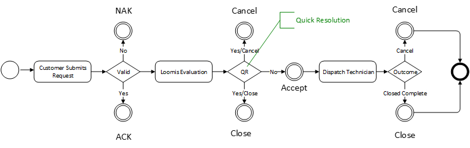

##### Table of Contents  
1. [Overview](#overview)  
2. [Transport](#transport)  
3. [JSON](#json-message-payload)  
  3.1. [Create an Incident](#create-an-incident)<br/>
  3.2. [Non Acknowledgement (NAK)](#non-acknowledgement-nak)<br/>
  3.3. [Acknowledgement (ACK)](#acknowledgement-ack)<br/>
  3.4. [Accept](#accept)<br/>
  3.5. [Close Complete](#close-complete)<br/>
  3.6. [Cancel](#cancel)

## Overview
Loomis supports the creation of Incidents for SafePoint service through REST based web services.  



Customers will send REST/JSON requests to Loomis and can expect update messages for **ACK**, **NAK**, **Accept**, **Close** and **Cancel**.

---
## Transport
REST Endpoint
> REST endpoint, authentication information and credentials will be provided during onboarding

---
#### Message Types
| Message Type | Details                                                |
|--------------|--------------------------------------------------------|
| dispatch     | Incident request provided by the customer              |
| nak          | Not Acknowledged - there was an issue with the request |
| ack          | Acknowledged                                           |
| accept       | Accepted and Estimated Time of Arrival info            |
| close        | Service completed successfully                         |
| cancel       | Service canceled                                       |

---
## JSON Message Payload

### Create an Incident
The Dispatch message is sent by a customer to request an SafePoint service. The request is evaluated for validity and appropriately processed.

#### Message Format
```json
{
	"MessageType": "Dispatch",
	"CustomerNumber": "A123456",
	"IncidentReference": "100001",
	"DeviceId": "UG1234",
	"ContactName": "John Smith",
	"ContactNumber": "123-123-1234",
	"ContactEmail": "john.smith@examplecustomer.com",
	"Subject": "Safe Door Issue",
	"Description": "Cannot open the door",
	"FaultCode": "AC12",
	"FaultDateTime": "2021-01-16T15:17:48Z"
}
```

#### Data Definitions 

| JSON Node           | Required | Details                                                                            |
|--------------------|----------|------------------------------------------------------------------------------------|
| MessageType        | Yes      | Describes the intended action for the message. Set to "Dispatch".                  |
| CustomerNumber     | Yes      | Specified customer ID. Provided by Loomis.                                         |
| IncidentReference  | Yes      | Customer incident number. This value is stored and returned in update messages.    |
| DeviceId           | Yes      | Safe Serial Number                                                                 |
| ContactName        | Yes      | Full Name of on-site customer                                                      |
| ContactNumber      | Yes      | Phone Number of on-site customer                                                   |
| ContactEmail       | No       | Email of on-site customer                                                          |
| Subject            | Yes      | Short description of the issue                                                     |
| Description        | Yes      | Description of the issue                                                           |
| FaultCode          | No       | Fault Code (If defined in contract)                                                |
| FaultDateTime      | Yes      | Date and Time when problem started, in UTC. Example: 2021-01-16T15:17:48Z          |


#### Fault Codes and IDs 
> Fault Codes will be defined during onbording (if defined in the contract)

---
### Non Acknowledgement (NAK)
NAK messages are returned to a customer in the event of issues processing the Incident Dispatch request. A NAK response will occur for the following reasons:

| Response Code     | Description                                                         |
|-------------------|---------------------------------------------------------------------|
| InvalidFault      | Invalid FaultCode for this customer.  (If Defined)                  |
| DeviceNotFound    | DeviceId is not found for this customer.                            |


#### Message Format
```json
{
	"MessageType": "NAK",
	"CustomerNumber": "A123456",
	"IncidentReference": "100001",
	"ResponseCode": "Duplicate",
	"ResponseText": "Additional information"
}
```
#### Data Definitions 
| JSON Node           | Required | Details                                                     |
|--------------------|----------|-------------------------------------------------------------|
| MessageType        | Yes      | Set to "NAK". Describes the intended action for the message.| 
| CustomerNumber     | Yes      | Specified customer number, provided by Loomis.              |
| IncidentReference  | Yes      | Customer incident number provided in initial request.       |
| ResponseCode       | Yes      | Reason for the NAK, see table Response Codes table.         |
| ResponseText       | Yes      | Additional information about this incident response.        |

---
### Acknowledgement (ACK)
A valid message request message will be processed and return an acknowledgement to the requesting entity.  

#### Message Format

```json
{
	"MessageType": "ACK",
	"CustomerNumber": "A123456",
	"IncidentId": "INC400300",
	"IncidentReference": "100001",
	"Status": "Open",
	"ResponseText": "Additional information"
}
```

#### Data Definitions 
| JSON Node           | Required | Details                                                      |
|--------------------|----------|--------------------------------------------------------------|
| MessageType        | Yes      | Set to "ACK". Describes the intended action for the message. | 
| CustomerNumber     | Yes      | Specified customer number, provided by Loomis.               |
| IncidentId         | Yes      | Loomis incident number created.                              |
| IncidentReference  | Yes      | Customer incident number provided in initial request.        |
| Status             | Yes      | Current status of Incident.        |
| ResponseText       | No       | Additional information about this incident response.         |

---
### Accept
The Accept message is sent when the incident is reviewed and assigned by Loomis. Accept indicates that the incident is assigned to a higher tier support entity to troubleshoot which may require on-site support or coordination.    

#### Message Format
```json
{
	"MessageType": "Accept",
	"CustomerNumber": "A123456",
	"IncidentId": "INC400300",
	"IncidentReference": "100001",
	"ResponseText": "Additional information",
	"SLADateTime": "2020-09-26T16:45:49Z",
	"DateTime": "2020-09-23T16:45:49Z"
}
```
#### Data Definitions

| JSON Node           | Required | Details                                                                          |
|--------------------|----------|----------------------------------------------------------------------------------|
| MessageType        | Yes      | Set to "Accept". Describes the intended action for the message.                  | 
| CustomerNumber     | Yes      | Specified customer number, provided by Loomis                                    |
| IncidentId         | Yes      | Loomis Dispatch Incident ID                                                      |
| IncidentReference  | Yes      | Unique customer incident number provided in initial request                      |
| SLADateTime        | Yes      | SLA date and time when request can be completed, UTC. Example: 2020-09-23T09:45:22Z |
| ResponseText       | No       | Optional - Notes about this response                                             |
---

### Close Complete
On successful completion of SafePoint service, a message will be generated with closure information.  A Closure message may be received before an Accept in the event that an incident was resolved at the time of the Loomis Evaluation.  

#### Message Format
```json
{
	"MessageType": "Close",
	"CustomerNumber": "A123456",
	"IncidentId": "INC400300",
	"IncidentReference": "100001",
	"ResponseText": "Close details",
	"DateTime": "2020-09-23T16:45:49Z"
}
```

#### Data Definitions

| XML Node           | Required | Details                                                             |
|--------------------|----------|---------------------------------------------------------------------|
| MessageType        | Yes      | Set to "Close". Describes the intended action for the message.      | 
| CustomerNumber     | Yes      | Specified customer number, provided by Loomis                       |
| IncidentId         | Yes      | Loomis Dispatch Incident ID                                         |
| IncidentReference  | Yes      | Unique customer incident number provided in initial request         |
| ResponseText       | Yes      | Closure information        |
| DateTime           | Yes      | Date and time service completed, in UTC. Example: 2020-09-23T09:45:22Z |
---

### Cancel
An incident can be cancelled by Loomis or the requesting customer for a variety of reasons.  

#### Message Format
```json
{
	"MessageType": "Cancel",
	"CustomerNumber": "A123456",
	"IncidentId": "INC400300",
	"IncidentReference": "100001",
	"ResponseText": "Cancel details",
	"DateTime": "2020-09-23T16:45:49Z"
}
```
#### Data Definitions

| XML Node           | Required | Details                                                            |
|--------------------|----------|--------------------------------------------------------------------|
| MessageType        | Yes      | Set to "Cancel". Describes the intended action for the message.    | 
| CustomerNumber     | Yes      | Specified customer number, provided by Loomis.                     |
| IncidentId         | Yes      | Loomis Dispatch Incident ID                                        |
| IncidentReference  | Yes      | Unique customer incident number provided in initial request        |
| ResponseText       | Yes      | Closure information including cancel reason and comments           |
| DateTime           | Yes      | Date and time service was canceled, in UTC. Example: 2014-09-23T09:45:22Z |
